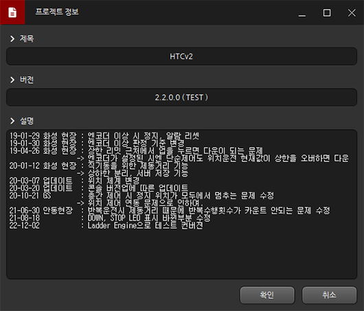

# 梯形图编辑器

## 概述
* 可编写/下载/监控PLC梯形图的开发工具
* 与[Devinno.PLC](https://github.com/devinno-kr/Devinno.PLC)的LadderEngine联动执行梯形图逻辑

<br />
<br />  

## 目录
 * 使用方法
   * [界面构成](#1-1-界面构成)
   * [项目信息](#1-2-项目信息)
   * [符号表](#1-3-符号表)
   * [通信配置](#1-4-通信配置)
   * [函数库](#1-5-函数库)
 * 指令说明
   * [特殊继电器](#2-1-特殊继电器)
   * [数据类型](#2-2-数据类型)
   * [运算符](#2-3-运算符)
   * [功能指令](#2-4-功能指令)


<br />
<br />  

## 1 使用方法

### 1-1 界面构成


<br />

* **工具栏**

|图标|名称|说明|
|:---:|:---:|:---|
||新建|创建新文件|
||打开|加载现有文件|
||保存|保存当前文件|
||另存为|将文件另存为新名称|
||语法检查|检查梯形图逻辑的有效性|
||项目信息|输入项目信息|
||符号表|设置设备区域大小或注册符号|
||通信配置|注册通信协议|
||函数库|注册库并指定访问变量|
||下载|将梯形图程序下载到连接设备|
||上传|从连接设备上传运行中的梯形图|
||监控|监控连接设备状态|

<br />

* **梯形图工具**

|图标|快捷键|名称|说明|
|:---:|:---:|:---:|:---|
||Space|删除|删除光标位置元素|
||F3|常开触点|直接使用输入信号的A型触点|
||F4|常闭触点|使用反向输入信号的B型触点|
||F5|水平线|用于梯形图连接的水平线|
||F6|垂直线|用于梯形图连接的垂直线|
||F7|输出线圈|当输入接通时激活输出|
||F8|功能调用|当输入接通时调用功能块|
||F9|取反|对输入信号进行逻辑非操作|
||F11|上升沿|仅在输入上升沿时接通|
||F12|下降沿|仅在输入下降沿时接通|

<br />

* **工作区**

|快捷键|说明|
|:---:|:---|
|Del|删除当前单元格|
|Shift + Del|删除当前行|
|Insert|插入空白单元格|
|Shift + Insert|插入空白行|
|Left|光标左移|
|Right|光标右移|
|Up|光标上移|
|Down|光标下移|
|PageUp|向上翻页|
|PageDown|向下翻页|
|Home|移动到行首|
|End|移动到行尾|
|Ctrl + Left|移动到行首|
|Ctrl + Right|移动到行尾|
|Ctrl + Up|移动到文档顶部|
|Ctrl + Down|移动到文档底部|
|Enter|输入内容|
|Ctrl + Z|撤销|
|Ctrl + Y|重做|
|Ctrl + C|复制选中区域|
|Ctrl + X|剪切选中区域|
|Ctrl + V|粘贴|
|Shift + Left|向左扩展选区|
|Shift + Right|向右扩展选区|
|Shift + Up|向上扩展选区|
|Shift + Down|向下扩展选区|
|Shift + PageUp|向上扩展一页|
|Shift + PageDown|向下扩展一页|
|Shift + Home|扩展到行首|
|Shift + End|扩展到行尾|
|Escape|清除复制内容|

<br />

* **结果窗口**

显示语法检查中发现的问题


|项目|说明|
|:---:|:---|
|行|问题单元格的行号|
|列|问题单元格的列号|
|消息|问题描述|

<br />

* **状态栏**

|图标|说明|
|:---:|:---|
||显示工作区光标位置|
||显示连接设备状态|

<br />

---

<br />


### 1-2 项目信息


<br />

|项目|说明|
|:---:|:---|
|标题|项目名称|
|版本|项目版本号|
|描述|项目说明或备注|

<br />

---

<br />

### 1-3 符号表


<br />

* **区域大小**

|项目|默认值|说明|
|:---:|:---:|:---|
|P|32768|输入输出触点区域大小|
|M|32768|内部继电器区域大小|
|T|2048|定时器区域大小|
|C|2048|计数器区域大小|
|D|4096|数据寄存器区域大小|

<br />

* **符号列表**

符号功能可将M0、P0等地址格式赋予别名  

在符号列表中可进行符号的注册/修改/删除

  

```
应用符号后在工作区将显示为此格式
```

<br />

---

<br />

### 1-4 通信配置

注册梯形图运行时使用的通信协议

* **通信列表**

 

|项目|说明|
|:---:|:---|
|通信类型|已注册通信协议类型|
|信息|已注册通信的摘要信息|
|...|修改已注册通信|

<br />

* **ModbusRTU从站**

 

```
在/dev/serial0端口以115200波特率运行ModbusRTU从站通信

各区域的Modbus默认地址如图所示且地址可修改    
```

<br />

* **ModbusRTU主站**

 

```
在/dev/serial0端口以115200波特率运行ModbusRTU主站通信

持续监控站号1设备的0x1000~0x101F触点和0x7000~0x7005数据区

将站号1设备中监控的0x1000地址触点与P100绑定

同理将0x1005、0x100B、0x101A、0x7000、0x7005分别与对应触点或数据区绑定
```

<br />

* **ModbusTCP从站**

 

```
作为站号1设备运行ModbusTCP从站通信

各区域的Modbus默认地址如图所示且地址可修改    
```

<br />

* **ModbusTCP主站**

 

```
连接192.168.0.101地址设备运行ModbusTCP主站通信

持续监控站号1设备的0x1000~0x101F触点和0x7000~0x7005数据区

将站号1设备中监控的0x1000地址触点与P100绑定

同理将0x1005、0x100B、0x101A、0x7000、0x7005分别与对应触点或数据区绑定
```

<br />

* **MQTT**

 

```
连接192.168.0.254的MQTT代理服务器

将/dev1/topic主题接收的值存入D10  
将/dev1/hum主题接收的值存入D11  
将/dev1/in1主题接收的值存入P10  
将/dev1/in2主题接收的值存入P11  

当P1值变化时发布到/dev1/out1主题  
当P2值变化时发布到/dev1/out2主题  
当P3值变化时发布到/dev1/out3主题  
```

<br />

---

<br />

### 1-5 函数库

* **函数库**  
 


```
函数库功能用于注册和调用除梯形图引擎基本功能外的扩展DLL

LadderDB.dll是连接数据库的示例DLL，支持MySQL连接

图中将MySQL功能的访问变量名指定为DB
```
<br />


* **工作区示例**


``` 
分析此梯形图程序：

1. 程序启动时调用DB.Begin函数输入数据库连接信息 

2. 每10ms将D10自增1

3. 当D10≥10时，通过DB.Insert插入Time=[当前时间]、Limit1=0、Temperature=36.4的值并复位D10

即本程序每10秒定期将Time、Limit1、Temperature信息记录到数据库
```
 
<br />

<br />

<br />

<br />

## 2 指令说明

### 2-1 特殊继电器

|继电器|说明|
|:---:|:---|
|@BEGIN|用户设置时仅在首次扫描周期执行|
|@10R|约10ms间隔的ON脉冲|
|@100R|约100ms间隔的ON脉冲|
|@1000R|约1000ms间隔的ON脉冲|
|@F10R|约10ms间隔的ON/OFF交替脉冲|
|@F100R|约100ms间隔的ON/OFF交替脉冲|
|@F100R|约1000ms间隔的ON/OFF交替脉冲|
|@ON|常ON状态|
|@OFF|常OFF状态|
 
<br />

---

<br />

### 2-2 数据类型

* **双字型**


```
[字区域].DW表示双字数据类型

如图所示例程：

D10.DW每次累加1，当前值为65610

65610的十六进制为0001 004A

各寄存器值分配如下：

D10 : 74 (0x004A) //低字
D11 : 1 (0x0001) //高字
```

<br />

* **浮点型**


```
[字区域].R表示浮点数据类型

如图所示例程：

每10ms将D10自增1

将D10的值除以100存入D20.R

当前D10值为2390，D20值为23.9(2390/100)

浮点数占用2个字，本例使用D20和D21
```

<br />

* **字符串型**


```
[字区域].S[n]表示字符串数据类型

如图所示例程：

每秒将D1自增1，当D1除以2余0时向D10.S4写入"偶数"，余1时写入"奇数"

当前D1值为51，余数为1，故D10.S4内容为"奇数"

.S后的数字表示字符串缓冲区大小(以字为单位)

D10.S4表示使用D10~D13共4个字作为字符串缓冲区

英文/数字每个字可存储2字符，韩文每个字存储1字符
```

<br />

* **位类型**


```
[字区域].[0:F]表示位数据类型

如图所示例程：

每秒将D10自增1并监控D10值

监控项显示D10的字值及其0~7位的状态

当前D10值为5，各位状态转换为二进制为

0000 0101，即十进制5

位操作仅适用于字区域，D0.0~D0.F可表示16个位状态
```
 
<br />

---

<br />

### 2-3 运算符

* **算术运算符**

|运算符|示例|说明|
|:---:|:---:|:---|
|+|a + b|a加b|
|-|a - b|a减b|
|*|a * b|a乘以b|
|/|a / b|a除以b|
|%|a % b|a除以b的余数|
 
<br />

* **自增/自减运算符**

|运算符|示例|说明|
|:---:|:---:|:---|
|++|a++|a值加1|
|--|a--|a值减1|
 
<br />

* **移位运算符**

|运算符|示例|说明|
|:---:|:---:|:---|
|<<|a << b|a左移b位|
|>>|a >> b|a右移b位|
 
<br />

* **关系运算符**

|运算符|示例|说明|
|:---:|:---:|:---|
|<|a < b|若a小于b为真|
|>|a > b|若a大于b为真|
|==|a == b|若a等于b为真|
|!=|a != b|若a不等于b为真|
|>=|a >= b|若a大于等于b为真|
|<=|a <= b|若a小于等于b为真|
 
<br />

* **赋值运算符**

|运算符|示例|说明|
|:---:|:---:|:---|
|=|a = b|将b赋给a|
|+=|a += b|等效a=a+b|
|-=|a -= b|等效a=a-b|
|*=|a *= b|等效a=a*b|
|/=|a /= b|等效a=a/b|
|%=|a %= b|等效a=a%b|
|<<=|a <<= b|等效a=a<<b|
|>>=|a >>= b|等效a=a>>b|

<br />

* **逻辑运算符**

<table>
    <tr>
        <th align="center">运算符</th>
        <th align="center">示例</th>
        <th align="left">说明</th>
    </tr>
    <tr>
        <td align="center">&&</td>
        <td align="center">a && b</td>
        <td>逻辑与(a和b均为真时结果为真)</td>
    </tr>
    <tr>
        <td align="center">||</td>
        <td align="center">a || b</td>
        <td>逻辑或(a或b任一为真时结果为真)</td>
    </tr>
    <tr>
        <td align="center">!</td>
        <td align="center">!a</td>
        <td>逻辑非(取反)</td>
    </tr>
</table>

<br />

* **位运算符**

<table>
    <tr>
        <th align="center">运算符</th>
        <th align="center">示例</th>
        <th align="left">说明</th>
    </tr>
    <tr>
        <td align="center">&</td>
        <td align="center">a & b</td>
        <td>按位与</td>
    </tr>
    <tr>
        <td align="center">|</td>
        <td align="center">a | b</td>
        <td>按位或</td>
    </tr>
    <tr>
        <td align="center">^</td>
        <td align="center">a ^ b</td>
        <td>按位异或</td>
    </tr>
</table>
 
<br />

---

<br />

### 2-4 功能指令

* **TON(通电延时定时器)**
```
· 语法
TON( [定时器号], 设定值 )

定时器号 : 仅限T寄存器
设定值 : 1~65535的常数或D寄存器

· 说明
当条件ON时，定时器以10ms为单位递增，达到设定值时触点ON
```

<br />

* **TAON(100ms通电延时定时器)**
```
· 语法
TAON( [定时器号], 设定值 )

定时器号 : 仅限T寄存器
设定值 : 1~65535的常数或D寄存器

· 说明
当条件ON时，定时器以100ms为单位递增，达到设定值时触点ON
```

<br />

* **TOFF(断电延时定时器)**
```
· 语法
TOFF( [定时器号], 设定值 )

定时器号 : 仅限T寄存器
设定值 : 1~65535的常数或D寄存器

· 说明
当条件ON时触点立即ON
当条件OFF时，定时器以10ms为单位递减，延时设定值时间后触点OFF
```

<br />

* **TAOFF(100ms断电延时定时器)**
```
· 语法
TAOFF( [定时器号], 设定值 )

定时器号 : 仅限T寄存器
设定值 : 1~65535的常数或D寄存器

· 说明
当条件ON时触点立即ON
当条件OFF时，定时器以100ms为单位递减，延时设定值时间后触点OFF
```

<br />

* **TMON(单脉冲定时器)**
```
· 语法
TMON( [定时器号], 设定值 )

定时器号 : 仅限T寄存器
设定值 : 1~65535的常数或D寄存器

· 说明
当条件ON(即使瞬间)时触点ON
定时器以10ms为单位递增，达到设定值时触点OFF
```

<br />

* **TAMON(100ms单脉冲定时器)**
```
· 语法
TAMON( [定时器号], 设定值 )

定时器号 : 仅限T寄存器
设定值 : 1~65535的常数或D寄存器

· 说明
当条件ON(即使瞬间)时触点ON
定时器以100ms为单位递增，达到设定值时触点OFF
```

<br />

* **SETOUT(置位输出)**
```
· 语法
SETOUT( [继电器号] )

继电器号 : 仅限P、M寄存器

· 说明
当条件ON时将指定继电器置位
```

<br />

* **RSTOUT(复位输出)**
```
· 语法
RSTOUT( [继电器号] )

继电器号 : 仅限P、M寄存器

· 说明
当条件ON时将指定继电器复位
```

<br />

* **MCS(主控开始)**
```
· 语法
MCS( 编号 )

编号 : MCS区块编号

· 说明
用于将梯形图划分为可控制区块的主控指令
表示区块开始
```

<br />

* **MCSCLR(主控结束)**
```
· 语法
MCSCLR( 编号 )

编号 : MCS区块编号

· 说明
用于将梯形图划分为可控制区块的主控指令
表示区块结束
```

<br />

* **WXCHG(字交换)**
```
· 语法
WXCHG( 存储器1, 存储器2 )

存储器1 : 交换源1
存储器2 : 交换源2

· 说明
交换两个存储器的内容
```

<br />

* **DIST(数据分配)**
```
· 语法
DIST( 源存储器, 目标起始地址, 数量 )

源存储器 : 数据源
目标起始地址 : 目标起始地址
数量 : 要存储的数据个数

· 说明
将16位值按4位为单位分割存储到目标存储器
```

<br />

* **UNIT(数据组合)**
```
· 语法
UNIT( 源起始地址, 目标存储器, 数量 )

源起始地址 : 数据源起始地址
目标存储器 : 目标地址
数量 : 要组合的数据个数

· 说明
将多个存储器的低4位组合存储到目标存储器
```
